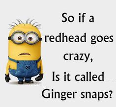

### CTF Statement:
```txt
Think the flag is somewhere in there. Would you help me find it?
https://mega.nz/#!OHohCbTa!wbg60PARf4u6E6juuvK9-aDRe_bgEL937VO01EImM7c
```

_[File Link](https://mega.nz/#!OHohCbTa!wbg60PARf4u6E6juuvK9-aDRe_bgEL937VO01EImM7c)_

---

The link in the challenge discription gives us the following image:
<br>



_Yep, it's a facebook minion meme (ffs...)_

<br>

We can extract the flag using the [`strings`](https://linux.die.net/man/1/strings) tool/command:

```zsh
$ strings 95f6edfb66ef42d774a5a34581f19052.jpg
JFIF
 , #&')*)
-0-(0%()(
((((((((((((((((((((((((((((((((((((((((((((((((((
L?~f
:UwR
y>2|

...
...
Lottsa stuff here :'D
...
...

$*,-
flag{wow!_data_is_cool}
$lqU
AG{u
Xm*CnC
@'hnQ
ax+p
bdQG
D_ O
```

We can shorten this by simply using [`grep`](https://linux.die.net/man/1/grep)

```zsh
$ strings 95f6edfb66ef42d774a5a34581f19052.jpg | grep flag
flag{wow!_data_is_cool}
```

---

#### The Flag:
    CTFlearn{wow!_data_is_cool}


Link to the challenge: [Forensics 101](https://ctflearn.com/challenge/96)
