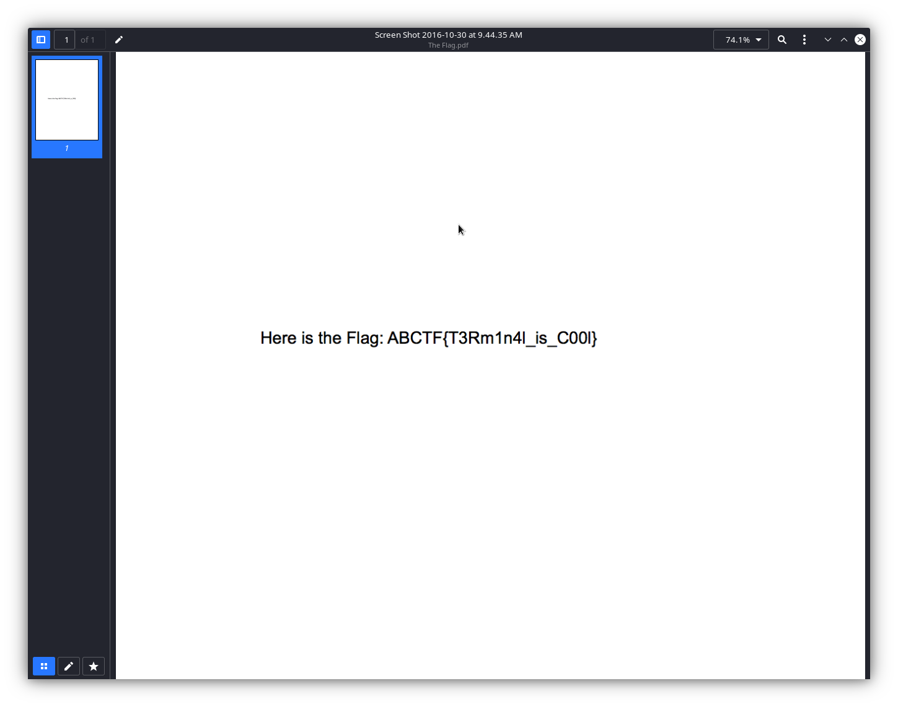

### CTF Statement:
```txt
Just take the Ls. Check out this zip file and I be the flag will remain hidden.
https://mega.nz/#!mCgBjZgB!_FtmAm8s_mpsHr7KWv8GYUzhbThNn0I8cHMBi4fJQp8
```

_[File Link](https://mega.nz/#!mCgBjZgB!_FtmAm8s_mpsHr7KWv8GYUzhbThNn0I8cHMBi4fJQp8)_

---

The link leads to a zip file, which we can unzip using [`unzip`]()

```zsh
$ unzip The\ Flag.zip
Archive:  The Flag.zip
   creating: The Flag/
  inflating: The Flag/.DS_Store
   creating: __MACOSX/
   creating: __MACOSX/The Flag/
  inflating: __MACOSX/The Flag/._.DS_Store
   creating: The Flag/.ThePassword/
  inflating: The Flag/.ThePassword/ThePassword.txt
  inflating: The Flag/The Flag.pdf
  inflating: __MACOSX/The Flag/._The Flag.pdf
```


The zip archive decompresses into 2 directories: `__MACOSX` and `The Flag`

We can directly open the pdf file using a GUI interface, and supply in the passsword from `The\ Flag/.ThePassword/ThePassword.txt`

```txt
cat ./.ThePassword/ThePassword.txt
Nice Job!  The Password is "Im The Flag".
```





And there we have it  :)


---

#### The Flag:
    ABCTF{T3Rm1n4l_is_C00l}


Link to the challenge: [Taking Ls](https://ctflearn.com/challenge/103)
