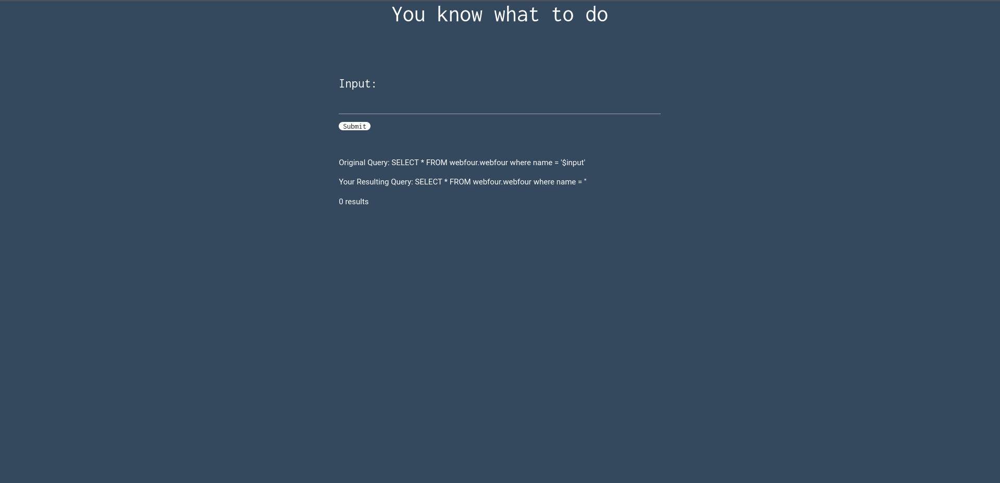
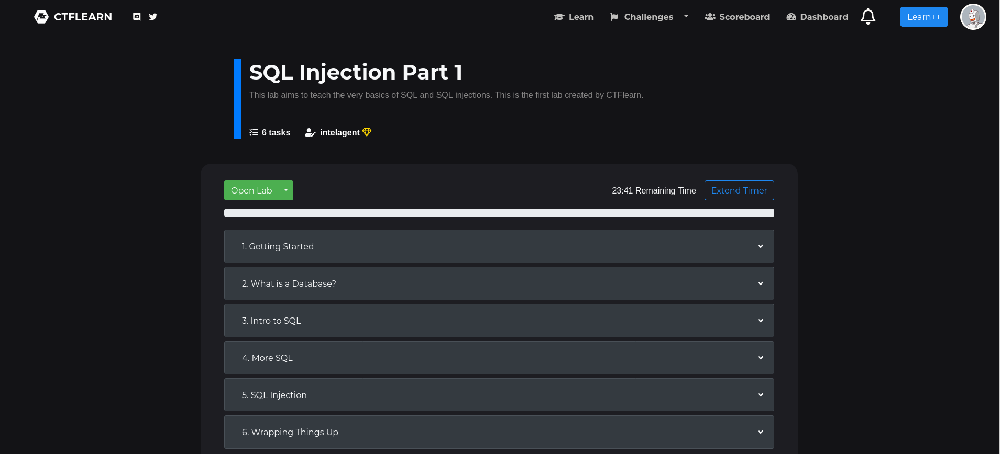
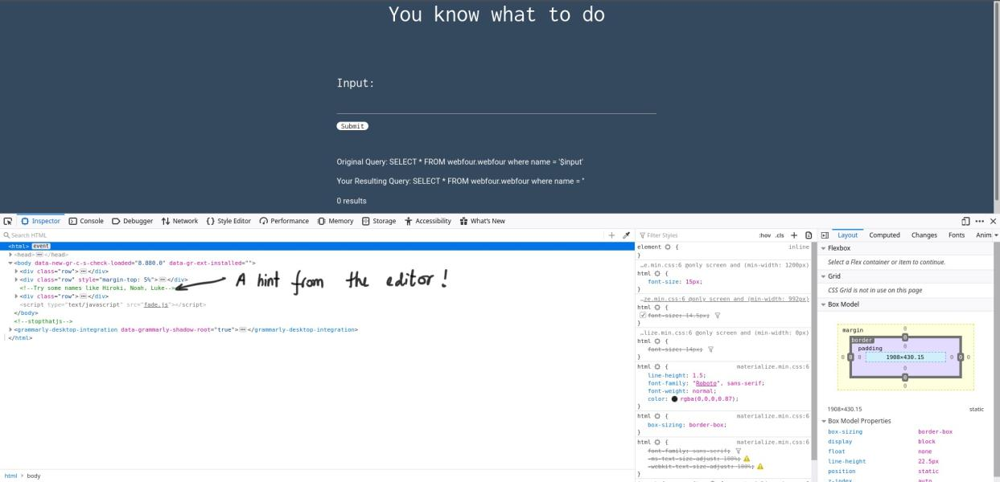
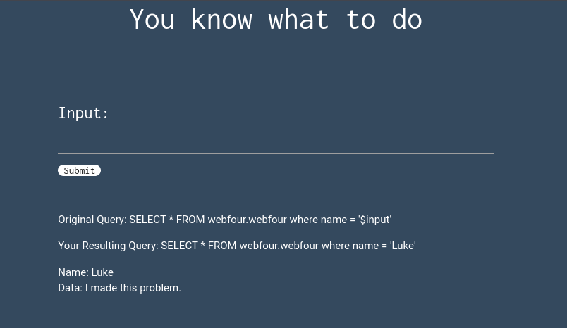
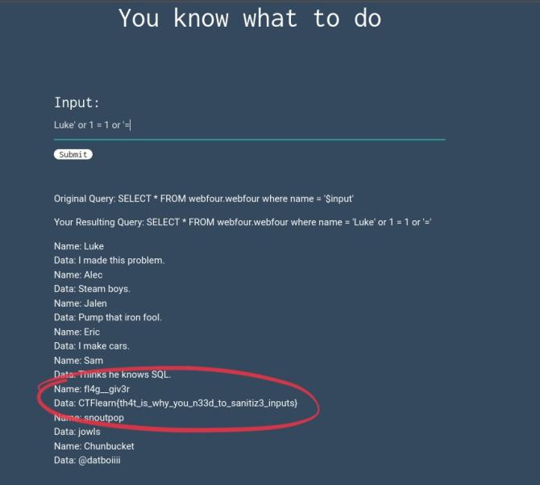

### CTF Statement:
```
See if you can leak the whole database using what you know about SQL Injections. link

Don't know where to begin? Check out CTFlearn's SQL Injection Lab
```

_[link](https://web.ctflearn.com/web4/)_
_[SQL Injection Lab](https://ctflearn.com/lab/sql-injection-part-1)_

---

The [first link](https://web.ctflearn.com/web4/) takes us to a SQL query processing website:



<br>
<br>

The [second link](https://ctflearn.com/lab/sql-injection-part-1) takes us to a tutorial webiste:



**Note**: _Go through the lab before solving if you're not familiar with SQL_

<br>

Upon inspecting the page of the first link we see:



<br>

When Luke is inserted into the input, we see:



We can fill in a query like:
```mysql
Luke' or 1 = 1 or '=
```



---

#### The Flag:
    CTFlearn{th4t_is_why_you_n33d_to_sanitiz3_inputs}


Link to the challenge: [Basic Injection](https://ctflearn.com/challenge/88)
