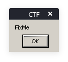

#### Problem Statement:
```txt
Find text like 'CTF{...}'
```

---

We've been give a file from the challenge (a zip file).
First we check the contents without extracting:


###### Command:

```shell
$ unzip -l <filename>.zip
```

###### Output;
```txt
Archive:  60f45a3033c5d42814fb33aa.zip
  Length      Date    Time    Name
---------  ---------- -----   ----
      555  2021-07-18 22:13   saenro-ctf-v2.exe
---------                     -------
      555                     1 file
```


As we can observe, there's a file named: `saenro-ctf-v2.exe`, an executable file.


To extract the zip file, we execute:

```shell
$ unzip -P crackmes.one <filename>.zip
```

**Note**: *The passoword for the files/zips is mentioned on the [FAQ page](https://crackmes.one/faq) of the website*


Furthermore, once extracted, we can execute `saenro-ctf-v2.exe` using the following command:

```shell
$ wine saenro-ctf-v2.exe
```

**Note**: *To install the [wine](https://linux.die.net/man/1/wine) tool, we may use*: `sudo apt-get install wine`

_Alternatively, one may try and execute this directly on a windows machine, or a virtual machine._

When we execute `saenro-ctf-v2.exe`, we get the following pop-up:




***The solution's Imcomplete ;-;***
***Gimme some more time and I'll solve it >.>***


---

Link to the challenge: [Saenro's CTF](https://crackmes.one/crackme/60f45a3033c5d42814fb33aa)
